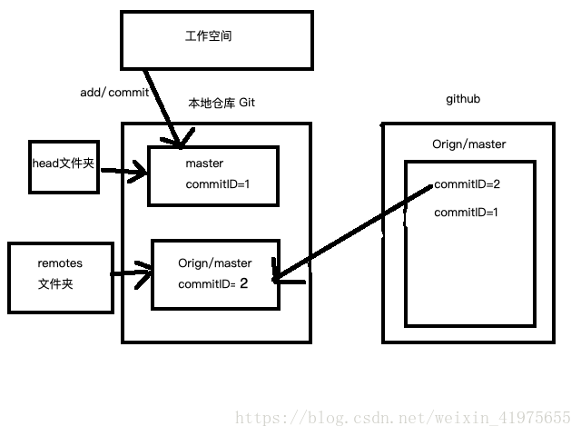
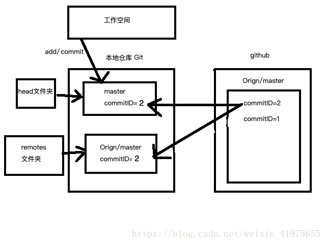

更新本地代码可以使用`git fetch + git merge`或者`git pull`两种方法。在实现上`fetch`和`pull`也有一些区别。

##### fecth

`git fetch`只从远程拉最新的代码，并修改本地缓存的远程分支的commitID，`git fetch`之后使用`git status`就会看到本地分支落后远程分支这种提示。工作示意图：

##### pull

`git pull`会做`git fetch`同样的工作，此外还会将远程分支直接合并到本地分支。`git pull`示意图：

以上图片引用自https://blog.csdn.net/weixin_41975655/article/details/82887273