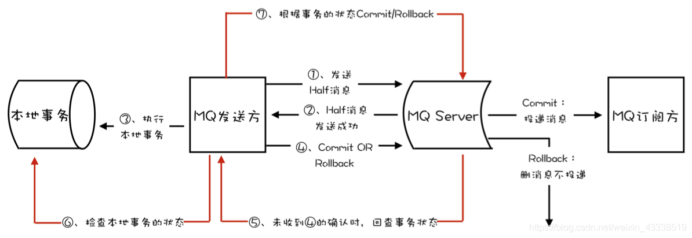

### 应用背景

考虑下单中锁定库存和发送消息这两个操作，

1. 锁定库存成功再发送消息到消息队列，这可能会出现锁定库存成功，但是发送消费时发送异常，就需要有回滚策略释放库存。
2. 在第一种方案的基础上，使用本地事务进行回滚。首先开启事务，锁定库存成功后发送消息到消息队列，当消息发送成功后提交事务。这时会产生消息队列发送成功，但是事务提交失败。

这种跨系统的事务统称为分布式事务，分布式事务像使用数据事务那样简单方便，如果要自己实现分布式事务是一件很费事的事，目前已经有不少分布式事务的解决方案。

### 分布式事务方案

- 二阶段提交： 二阶段提交将事务分为prepare阶段和commit阶段，在prepare阶段协调者和各个事务参与者确认是否可以提交事务，如果都可以提交事务，协调者会给所有事务参与者发送commit消息。完整的二阶段提交主要是要考虑安全性和存活性问题。详细可以参考[理解二阶段提交事务](https://blog.csdn.net/lengxiao1993/article/details/88290514)
- 三阶段提交TCC: 在二阶段提交方案中有一种情况：事务参与者没有收到commit消息，会一直等待，或者询问事务协调者造成事务参与者阻塞，如果引入超时机制，当超时时就会产生不一致。因此三阶段提交引入了PreCommit阶段，保证在PreCommit阶段收到所有事务参与者的确认之后，事务参与者处于一致状态。最后DoCommit阶段，并且使用超时机制，如果超时事务参与者可以直接提交事务避免阻塞，只能保证大概率的一致性。
- 分布式一致性算法：PBFT、PAXOS

### RocketMQ事务消息实现

RocketMQ使用的事务消息基于二阶段提交，流程图如下:

其中MQ发送方也就是SDK中的客户端充当事务协调者，half消息落盘之后的确认表示server的prepare消息，然后本地事务执行完成之后就相当于所有事务参与者prepare了，可以直接提交。Server在事务提交整个分布式事务提交之后才会将消息发布给消费组。