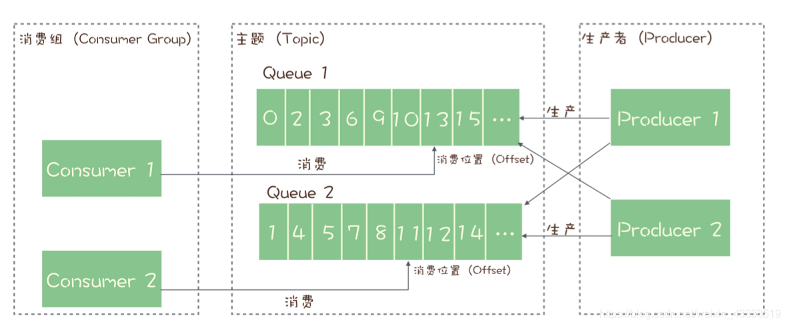

### RocketMQ消息队列模型

1. RocketMQ中有生产者、消费者、topic等概念，每个topic可以包含多个队列，通过多个队列来实现并行生成和消费。只能保证队列上晓得有序性，在topic中不能保证有序性。
2. RocketMQ中一条消息能被多个消费组消费，每个消费组内的多个消费者不能消费同一条消息。
3. broker需要在每个队列上为每个消费组保存消费位置，每消费一条消息，位置加1。

