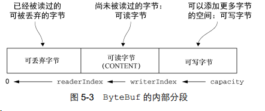

#### 扩容

ByteBuffer在进行put操作时，若缓冲区可写入空间不足会产生BufferOverFlowException异常。因此ByteBuffer每次put操作时都需要对可用空间进行校验，空间不足时会自动创建一个新的ByteBuffer，将就的ByteBuffer复制到新的中，然后释放旧的ByteBuffer。

ByteBuf对ByteBuffer进行封装时，在write方法中进行空间的校验，如果空间不足就会自动进行扩容，对于使用者来说不需要关系底层的实现。扩容时不超过4M倍增，超过按4M增加。

#### 读写指针

ByteBuffer中读写转换时需要使用flip移动指针位置，才能正常使用。ByteBuf分别读指针和写指针将ByteBuf分为如下3个部分：

1. `read`、`skip`开头的操作都会移动读指针。
2. `write`开头的操作都会移动写指针，超过容量而且无法扩容则会产生异常。
3. `discardBreadBytes`会回收已读过的区域，可能会涉及到内存的拷贝。
4. `clear`会将读写指针置0，不涉及内存拷贝。

#### 三种缓冲区类型

##### Heap Buffer

HeapBuffer又称为支撑数组，将数据存放在JVM的堆空间，通过将数据存储在数组中实现，具有以下特点：

1. 数据在JVM中可以快速创建和快速释放。
2. 数据可以直接快速访问。
3. 进行IO传输时需要将数据拷贝到直接缓存区。

##### Direct Buffer

Direct Buffer属于堆外分配的直接内存，不会占用JAVA Heap的容量，具有以下特点：

1. 适用于套接字传输，避免数据从Java Heap到Native Heap的拷贝。
2. 分配和释放耗时。

##### Composite Buffer

提供一个或者多个ByteBuf的组合视图，可以根据需要添加和删除不同类型的ByteBuf。

1. 组合多个ByteBuf，避免拷贝和分配新的缓存区。
2. 不支持访问职称数组，如果需要访问需要将内容拷贝到堆内存中再访问。

#### 池化

Netty中申请内存大小分为Tiny/Small/Normal/Huge4种不同级别，其中除Huge之外都使用JEMalloc内存分配算法进行分配和管理，也就是池化内存，而Huge级别的内存直接分配。JEMalloc内存管理中有以下几个关键组件：

1. PoolArena：维护所有可分配内存，内部若干个用双链表连接的PoolChunkList。
2. PoolChunkList：包含若干个PoolChunk，同一个PoolChunkList中的PoolChunk的使用率接近。
3. PoolChunk：使用伙伴分配算法管理的一大块内存，PoolChunk分为若干个Page，默认PoolChunck大小为16MB，每个Page为8KB，使用完全二叉树管理Page的分配。
4. PoolSubPage：内存的最小分配单元，以第一次请求的大小对Page进行切分，例如第一次请求16B，则8KB的Page被分为512块PoolSubPage。相同大小的PoolSubPage会使用双向链表连接，并分组存储。
5. PoolThreadCache：

#### 引用计数

Netty中有ReferenceCounted接口专门用于负责追踪内存使用。retain方法增加引用计数，release方法减少引用计数。该功能主要是针对direct内存。

参考

[自顶向下深入分析Netty](https://www.jianshu.com/p/15304cd63175)

